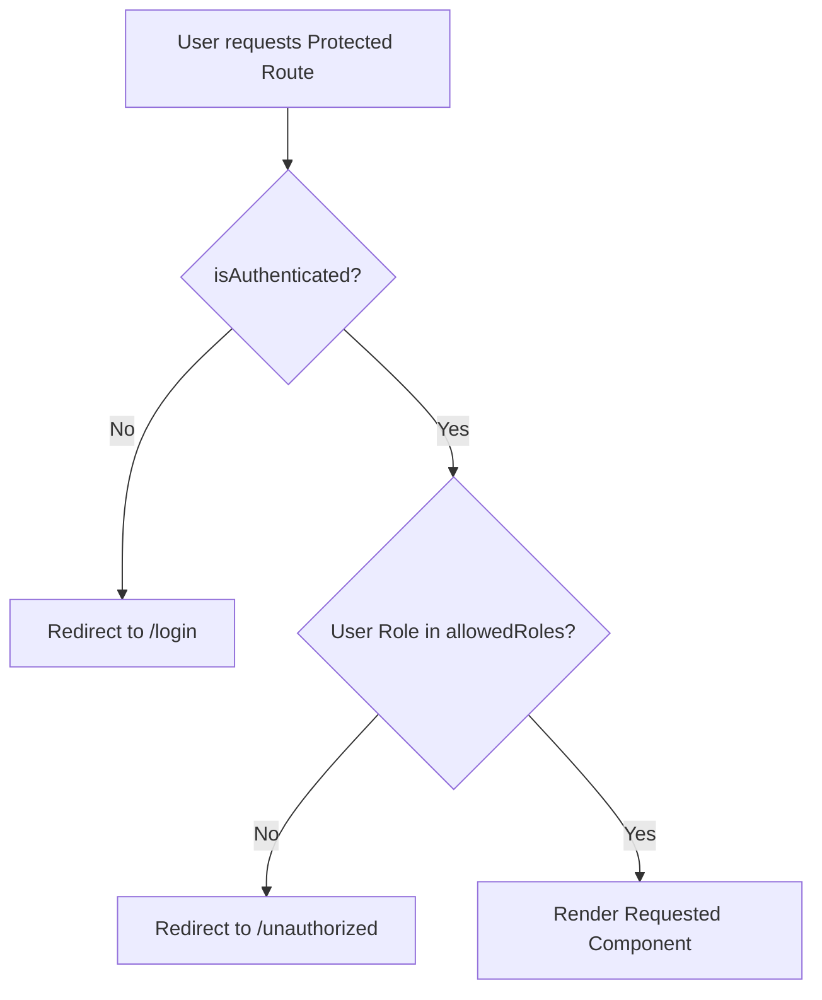
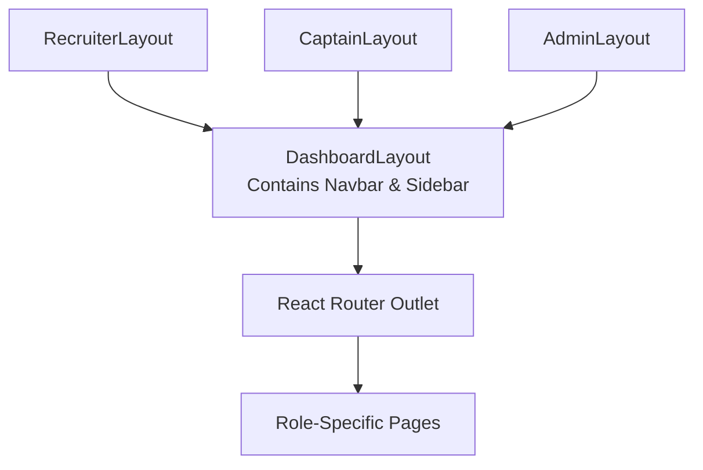

# React Dashboard Project Scaffolding

## 📖 Overview

This project provides the foundational scaffolding for a multi-developer, role-based dashboard application. Built with React and TypeScript, it establishes a scalable architecture with protected routing, modular layouts, and a mock authentication context.

The primary problem this project solves is establishing a secure, extensible foundation for parallel development. By abstracting routing and layout complexities early on, future developers can focus strictly on building role-specific features (e.g., Recruiter Pipelines, Captain Analytics) without worrying about authentication state, responsive navigation, or route protection.

---

## ✨ Features

- **Protected Routing**: Reusable `<ProtectedRoute />` component that guards routes against unauthenticated or unauthorized access.
- **Role-based Access Control**: Native support for three distinct roles (Recruiter, Captain, Admin).
- **Authentication Context**: Centralized `AuthContext` and `useAuth()` hook for state management (currently using mock data).
- **Modular Layouts**: DRY architecture featuring a core `DashboardLayout` wrapped by role-specific layouts.
- **Responsive Navigation**: Includes a responsive Sidebar (collapsible on mobile) and a Navbar with a hamburger menu.
- **Role-Specific Dashboards**: Clean skeleton dashboards for Recruiter, Captain, and Admin.
- **Route Testing Buttons**: Each dashboard includes buttons to test cross-role navigation, verifying that protected routing correctly redirects unauthorized access.
- **Error Handling**: Dedicated `Unauthorized` (403) and `NotFound` (404) pages.
- **CSS Custom Properties**: A centralized theme managed via native CSS variables and modular CSS files.

---

## 🛠️ Tech Stack

| Technology | Purpose |
|------------|---------|
| **React** | UI Library |
| **TypeScript** | Static Typing |
| **Vite** | Build Tool & Dev Server |
| **React Router DOM** | Client-Side Routing |
| **Context API** | Global State Management |
| **CSS Modules** | Component-Scoped Styling |

---

## 📁 Folder Structure

```text
src/
├── assets/                  # Static assets (images, icons)
├── components/              # Reusable UI components
│   ├── Navbar/              # Top navigation bar
│   ├── ProtectedRoute/      # Route guard logic
│   └── Sidebar/             # Side navigation panel
├── constants/               # Global constants
│   └── roles.ts             # Role definitions (Recruiter, Captain, Admin)
├── context/                 # Global state providers
│   └── AuthContext.tsx      # Mock authentication context provider
├── hooks/                   # Custom React hooks
│   └── useAuth.ts           # Accessor for AuthContext
├── layouts/                 # Structural page wrappers
│   ├── AdminLayout.tsx      # Admin-specific layout wrapper
│   ├── CaptainLayout.tsx    # Captain-specific layout wrapper
│   ├── DashboardLayout.tsx  # Core DRY layout containing Navbar & Sidebar
│   └── RecruiterLayout.tsx  # Recruiter-specific layout wrapper
├── pages/                   # Route-level components
│   ├── Admin/               # Admin dashboard skeleton
│   ├── Captain/             # Captain dashboard skeleton
│   ├── Login/               # Mock login page for role switching
│   ├── NotFound/            # 404 Error page
│   ├── Recruiter/           # Recruiter dashboard skeleton
│   └── Unauthorized/        # 403 Access Denied page
├── routes/                  # Routing configuration
│   └── AppRoutes.tsx        # Centralized route definitions
├── types/                   # TypeScript interfaces and types
│   └── auth.ts              # User and AuthContext types
├── App.tsx                  # Root application component
├── index.css                # Global styles and CSS variables
└── main.tsx                 # Application entry point
```

---

## 🏗️ Architecture

The application is built on a **modular, feature-first architecture** designed to scale:

- **Separation of Concerns**: Components, layouts, pages, and context are strictly segregated.
- **DRY Layouts**: Instead of duplicating code across three layouts, a core `DashboardLayout` handles the Navbar, Sidebar, and responsiveness. `RecruiterLayout`, `CaptainLayout`, and `AdminLayout` are simply thin wrappers passing the correct role.
- **Agnostic Auth Abstraction**: `ProtectedRoute` and UI components rely solely on the `useAuth()` hook. The actual implementation of authentication (currently mocked) is isolated to `AuthContext.tsx`.
- **Nested Routing**: Leveraging React Router's `<Outlet />`, feature pages render dynamically inside their parent layout without requiring redundant layout imports.

---

## 🧭 Routing

| Route | Access | Description |
|-------|--------|-------------|
| `/` | Public | Root redirect. Routes authenticated users to their specific dashboard, or unauthenticated users to `/login`. |
| `/login` | Public | Mock login page featuring quick-switch buttons for testing roles. |
| `/unauthorized` | Public | 403 Error page shown when a user accesses a route not meant for their role. |
| `/recruiter` | Recruiter | Protected dashboard skeleton for Recruiters. Includes test buttons to navigate to Captain and Admin routes. |
| `/captain` | Captain | Protected dashboard skeleton for Captains. Includes test buttons to navigate to Recruiter and Admin routes. |
| `/admin` | Admin | Protected dashboard skeleton for Admins. Includes test buttons to navigate to Recruiter and Captain routes. |
| `*` | Public | 404 Error page for undefined routes. |

---

## 🔐 Authentication Flow

The current authentication mechanism is a **mock implementation** designed strictly for development and testing.

1. The app initializes with `user: null` in the `AuthContext`.
2. Unauthenticated users are redirected to the `/login` page.
3. The `/login` page contains mock buttons to instantly assume the identity of a Recruiter, Captain, or Admin.
4. Calling `login(mockUser)` updates the `AuthContext` and redirects the user to their designated dashboard.
5. Calling `logout()` clears the context and returns the user to `/login`.

---

## 🛡️ Protected Route Flow



---

## 📐 Layout Structure



---

## 🚀 How to Extend the Project

This foundation is designed to be easily extended by multiple developers.

### Adding a New Protected Route (Feature Page)
To add a new feature (e.g., a candidate pipeline for Recruiters):
1. Create the page component in `src/pages/Recruiter/Pipeline.tsx`.
2. Open `src/routes/AppRoutes.tsx`.
3. Add the route as a child inside the `<Route path="/recruiter">` block:
   ```tsx
   <Route path="pipeline" element={<Pipeline />} />
   ```

### Adding a New Role
1. Update `UserRole` in `src/types/auth.ts`.
2. Add the new role to `ROLES` in `src/constants/roles.ts`.
3. Create a layout wrapper (e.g., `ManagerLayout.tsx`) that passes the new role to `DashboardLayout`.
4. Register the new protected route block in `AppRoutes.tsx`.

---

## 💻 Installation

### Prerequisites
- Node.js (v18+)
- npm

### Setup

```bash
# Clone the repository
git clone <repository-url>
cd dashboard-project-scaffolding

# Install dependencies
npm install

# Start the development server
npm run dev
```

---

## 📸 Screenshots

### Login
*(Add screenshot)*

### Recruiter Dashboard
*(Add screenshot)*

### Captain Dashboard
*(Add screenshot)*

### Admin Dashboard
*(Add screenshot)*

### Unauthorized
*(Add screenshot)*

---

## 🔮 Future Improvements

- Replace mock `AuthContext` implementation with actual JWT authentication.
- Fetch navigation links dynamically based on role/permissions instead of hardcoding them in the Sidebar.
- Implement lazy loading (`React.lazy` and `Suspense`) for nested routes to optimize bundle size.

---

## ✍️ Author

*(Placeholder)*
# dashboard-project-scaffolding

